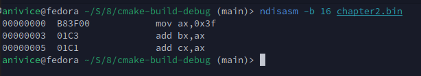

# Chapter 2: Assembly

## Assembly Overview

We are very familiar with `ls` command, right?
This command is often used to list all files and directories inside the current directory,
and is probably the first command you are taught when you first learned how to operate in
the console.
As we all know, `ls` also accepts parameters (assuming you know, and you should know.
And, if you really don't know, you really need to reconsider before continuing further),
such as a `/`, to list all files and directories under the root directory (`/`).

Actually, in a nutshell, this is what assembly essentially is.
Assembly code is a sequence of instructions instead of what we call commands,
with operands instead of what we know as parameters or arguments, that tells the processor
instead of the shell/interpreter, to perform specific tasks.

Here is an example assembly code of Intel 8086, in Intel syntax, for NASM assembler,
which is the syntax that we will be using throughout this entire tutorial:

<a id="assembly-code"></a>
```nasm
    MOV AX, 0x3F
    ADD BX, AX
    ADD CX, AX
```

> **Note:** Capitalization doesn't matter, but it's normally recommended to keep them
> consistent.
> Garbage like `mOv aX, 0xaFDc` is obviously off the table, unless you want to troll in
> someone else's code base, which, of course, is always recommended to do.
> (No, I'm kidding, please don't. That's a good way to get yourself yelled at and possibly
> get banned, especially if you are working with beasts like Linus Torvalds, who will
> actually skin you alive for this.)

In the above example, we have:
- `MOV AX, 0x3F`: moves the value `0x3F` into the `AX` register.
- `ADD BX, AX`: adds the value in `AX` to the `BX` register.
- `ADD CX, AX`: adds the value in `AX` to the `CX` register.

> The use of the `0x` prefix to indicate hexadecimal numbers was likely
> popularized by Unix, though the exact origin I know not (sorry I have to talk like a
> priest from the 1500s).
> The development of Unix had very heavy reliance on the C language which was where the `0x`
> prefix appeared in the first place (likely).
> The subsequent popularity of both C and UNIX helped establish the `0x` prefix as
> an off-the-record-and-non-standard indication for hexadecimal numbers in the long run.
> However, this is not mandatory.
> Apparently, appending an 'H' at the end of the number without `0x` prefix does the same job,
> which is what the world renowned genius and billionaire Bill Gates also promoted,
> though nobody is really using this indication anymore at this day of age and anyone
> who still uses it is often considered working on a CRT screen and a setup with active
> floppy disks and tape readers in their parents' garage with slides shoes for all four
> seasons.

## Compiler (Assembler) and Corresponding Tools Installation

In this tutorial, the following tools are employed:

- `nasm` (Netwide Assembler)
- `cmake` (build tool)
- `make`/`ninja` (build automation tool)
- `xxd` (A hexadecimal map tool in VI Improved text editor package)
- `gcc` (GNU Compiler Collection)
- `gdb` (GNU Debugger)

## Compilation (Assembling) and Disassembling

All assembly codes in this tutorial can be compiled using the following command:

```bash
    # Ensure you are at the root of the project tree, where CMakeLists.txt located
    mkdir build && cd build && cmake .. && make
```

The compiled binary file for [the above assembly code](#assembly-code)
is named as `chapter2.bin`. You can view its contents using the following command:

```bash
    xxd < chapter2.bin
```

This will display the binary content in a hexadecimal map:


Hexadecimal map is useful for general-purpose data inspection, but is useless
when you want a human-readable code printed onto your screen.
Luckily, we can disassemble it, which is the reverse process of assemble/compile
(turning handwritten code into a machine-readable binary sequence) using `ndisasm`.
To disassemble `chapter2.bin`, use the following command:

```bash
    ndisasm -b 16 chapter2.bin
```

The disassembled instructions will be printed onto the console output:



---

[Chapter 3](3_qemu.md)

[Back to the Main Page](../README.md)

