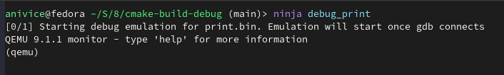
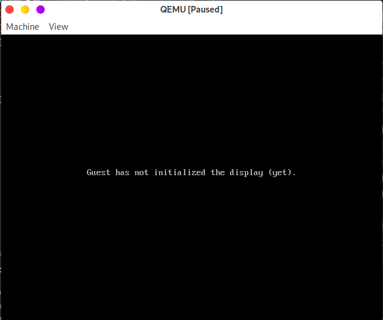
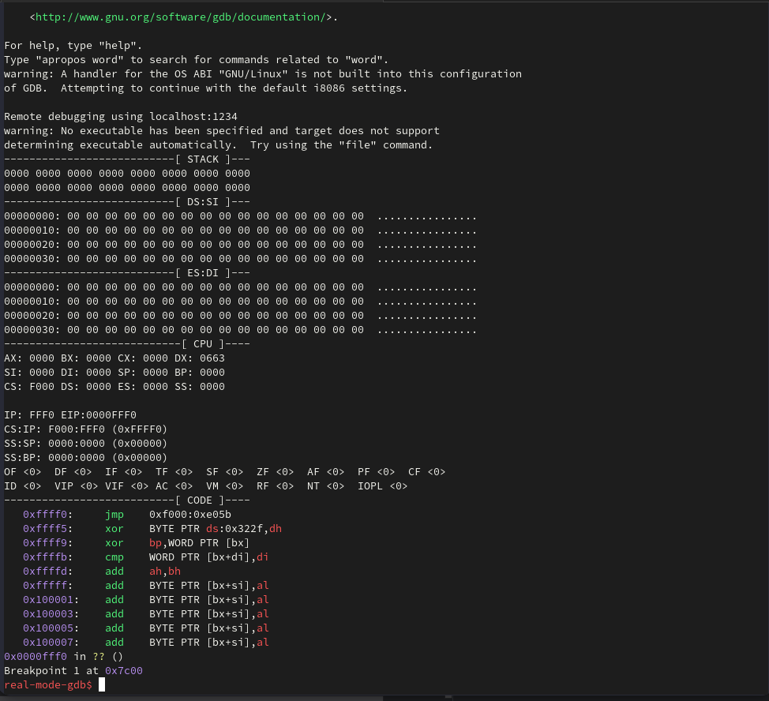

# Chapter 3.1: Assembly Example `movsb`

In Chapter 3, we covered techniques for manipulating VRAM. However,
setting VRAM bytes individually can be a lengthy and tedious process.

That's why we use `movsb`/`movsw` to efficiently transfer large blocks of
contiguous data between memory locations, much like how `memcpy()` is used
in higher-level programming languages.

## Workflow of Using `movsb`

The `movsb` instruction is used for efficient block data transfers between memory
locations. It relies on four critical components to function correctly:

1. **`DS:SI`**: Points to the source data (e.g., the message string in the bootloader).
2. **`ES:DI`**: Points to the destination (e.g., VRAM for text display).
3. **`CX`**: Specifies the number of bytes to transfer.
4. **`DF`**: Cleared with `cld` to ensure forward traversal of memory.

### **1. Setting `DS:SI` (Source Address)**

The `DS:SI` pair specifies the starting address of the source data in memory.

- **`DS` (Data Segment)**: Sets the base address of the memory segment containing
  the source data.
- **`SI` (Source Index)**: Provides the offset within the `DS` segment.

For `movsb`, the source data is read from `[DS:SI]`.
By setting `DS` to the segment where the data resides (e.g., `0x07C0`)
and `SI` to the relative offset of the data label (e.g., `msg - StartingPoint`),
we ensure the instruction accesses the correct memory location.

### **2. Setting `ES:DI` (Destination Address)**

The `ES:DI` pair specifies the starting address of the destination memory
where the data will be written.

- **`ES` (Extra Segment)**: Sets the base address of the destination memory segment.
                            For example, `0xB800` is used for the Video RAM (VRAM).
- **`DI` (Destination Index)**: Provides the offset within the `ES` segment.

For `movsb`, the destination data is written to `[ES:DI]`.
By setting `ES` to `0xB800` (the segment for VRAM) and `DI` to `0x0000`
(the starting offset), we ensure the instruction writes the data to the correct
screen memory location.

### **3. Setting `CX` (Count of Bytes to Transfer)**

The `CX` register is used by the `rep` prefix to specify the number of iterations
for repeated instructions like `movsb`.

- For `rep movsb`, the instruction will transfer one byte per iteration until `CX`
  reaches zero.
- By setting `CX` to the length of the data (e.g., `[ds:msg_len - StartingPoint]`),
  we ensure that all bytes of the message are transferred.

This setup allows `movsb` to automatically process the correct number of bytes
without additional loops or conditions in the code.

### **4. Setting `DF` (Direction Flag)**

The `DF` (Direction Flag) controls how `SI` and `DI` are adjusted after each data
transfer:

- **When `DF = 0` (via `cld`)**: Both `SI` and `DI` increment after copying the data, 
                                 enabling forward traversal through memory.
- **When `DF = 1` (via `std`)**: Both `SI` and `DI` decrement after copying the data,
                                 enabling backward traversal through memory.

By adding the `cld` instruction before `rep movsb`, we ensure that `DF` is
cleared (`DF = 0`), so the data is copied forward, which is the typical use
case for sequential memory transfers.

By configuring these registers and clearing the Direction Flag, the `rep movsb`
instruction efficiently copies the data byte-by-byte from the source (`[DS:SI]`)
to the destination (`[ES:DI]`) for the specified number of bytes (`CX`).
This setup eliminates the need for manual loops and ensures accurate and
efficient data transfers.

Now, let's walk through the process of writing a "Hello, World!" program in
assembly and use our customized GDB setup to debug it step by step.

---

## Assembly Code

The first line of the code is `[bits 16]`. This directive tells NASM that the
following instructions should be assembled for a 16-bit environment,
which is crucial for real mode operations on x86 processors.
```nasm
1   [bits 16]                                       ; 16-bit mode
```

This line uses the `equ` directive in NASM, which functions similarly to `#define`
in C and C-like languages. It allows you to define a constant value or label that
remains fixed throughout the code. By using `equ`, you can create symbolic names
for values, improving code readability and maintainability.
In this case, `StartingPoint equ 0x7C00` defines `StartingPoint` as a symbolic
constant for the memory address `0x7C00`, making it easier to reference and update
this value if needed.
```nasm
2   StartingPoint equ 0x7C00                        ; Boot sector loads at 0x7C00
```

This line defines the starting point of the code.
In real mode, code execution is addressed linearly within a small vicinity of memory.
Although we know that the code will be loaded at `0x0000:0x7C00`,
NASM does not have this context by default. Without guidance, NASM will assume the code
starts at offset `0x0000` and calculate all offsets, labels, and references to `$`
relative to this incorrect starting point. This misalignment would lead to errors when
the program is executed. To prevent this, we explicitly inform NASM of the code's
actual memory location using the `[org]` directive, so it correctly calculates offsets
and labels based on the proper load address.
```nasm
3   [org StartingPoint]
```

We begin by jumping to the `start` label. Immediately following `start` is the data
section. The way data sections are handled in MBR assembly is vastly different from
how they are managed in C code. In C, the compiler and operating system manage
separate memory regions for code and data, ensuring that the processor doesn’t
mistakenly execute data as instructions. However, in assembly, particularly in MBR
code, the processor has no such capability to distinguish between instructions and
data. It simply executes whatever is in memory. To avoid accidental execution of the
data section as code, we explicitly jump over the data section at the start of the
program. This ensures the processor begins executing the intended instructions while
skipping over the embedded data.
```nasm
4   ; jump over the data section
5   jmp start
```

Here is the data section. The `db` directive is used to define 8-bit data (bytes),
while `dw` is used to define 16-bit data (words). We use the `msg` label to mark
the starting address of the data section and `msg_len` to calculate the length of
the message in bytes. At first glance, this setup seems correct; however, there
are several important issues that need to be addressed, particularly concerning
how the data is accessed and managed. These challenges will be discussed
in detail later.
```nasm
6   ;;;;;;;;;;;;;;;;;;;;;;;;;;;;;;;;;;;;;;;;;;;;;;;;;;;;;;;;;;;;;;;;;;;;;;;;;;;;;;;;;;;;;;;
7   ; Message:
8   msg:
9       db 'H', 0x07, 'e', 0x07, 'l', 0x07, 'l', 0x07, 'o', 0x07, ',', 0x07, ' ', 0x07
10      db 'W', 0x07, 'o', 0x07, 'r', 0x07, 'l', 0x07, 'd', 0x07, '!', 0x07
11  msg_len:
12      dw $ - msg                                  ; Length of the message
13  ;;;;;;;;;;;;;;;;;;;;;;;;;;;;;;;;;;;;;;;;;;;;;;;;;;;;;;;;;;;;;;;;;;;;;;;;;;;;;;;;;;;;;;;
```

Now, let's examine the code section. We set the `ds` (Data Segment) register to
`0x07C0`. This value is used because of how segmented addressing works:
the segment value is shifted left by 4 bits and then the offset is added to
determine the physical memory address. Since the code is loaded at `0x0000:0x7C00`,
the segment part is `0x07C0`.

So, why do we first load `0x07C0` into `ax` and then transfer it to `ds`?
The reason is that, for architectural reasons, we cannot directly assign a constant
value to the `ds` register. Segment registers like `ds` can only be loaded indirectly
through general-purpose registers such as `ax`. While this might seem like an extra
step, it is a necessary one due to the limitations of the x86 instruction set.

Next, we need to set `si` (Source Index) with the correct offset.
At first glance, assigning `msg` to `si` seems correct, but it doesn't account
for the fact that we have relocated the program to start at `0x7C00`.
NASM calculates all label offsets relative to the start of the program
(`[org StartingPoint]`), so `msg` already includes this base offset.
To ensure `si` points to the correct memory location relative to the `ds` segment,
we subtract `StartingPoint` from `msg`.

This adjustment ensures `si` contains the correct offset for use with `ds`,
which starts at `0x7C00`. Importantly, this subtraction is performed at
**compile time** because both `msg` and `StartingPoint` are constants.
This means no additional runtime overhead is introduced by this operation.
```nasm
14  start:
15      ; Setup data segment
16      mov ax, 0x07C0                              ; Segment of the bootloader
17      mov ds, ax
18      ; Setup source [DS:SI]
19      mov si, msg - StartingPoint                 ; SI points to the message
```

The same logic applies to `es:di`, but in this case, we point it to `0xB8000`,
the starting address of Video RAM (VRAM). Setting `es` to `0xB800` establishes
the segment base for VRAM, and we initialize `di` (Destination Index) to `0x0000`
so that it points to the start of this segment.

Since VRAM is mapped directly to physical memory, there’s no need for additional
adjustments like the ones we made for `ds:si`. The combination of `es` and `di`
ensures that data written via `es:di` will be correctly displayed on the screen.
By carefully setting these registers, we establish a direct path for transferring
our message to VRAM.
```nasm
20      ; Setup destination [ES:DI] (Video memory at 0xB8000)
21      mov ax, 0xB800                              ; Segment of video memory
22      mov es, ax
23      xor di, di                                  ; DI starts at offset 0
```

We set `cx` to the length of the data, which is provided by
`[ds:msg_len - StartingPoint]`. This ensures `cx` contains the correct byte
count for the `rep movsb` instruction.

Since `msg_len` is a label within the data section, it is offset relative to
the program's starting point (`StartingPoint`). We've already correctly set
`ds` to `0x07C0`, aligning it with the relocated program segment, and explained
why it's necessary to subtract `StartingPoint` from `msg_len`.
This adjustment ensures the length is calculated relative to `ds` and is
accurate for the memory operations that follow.
```nasm
24      ; Set CX to the length of the message
25      mov cx, [ds:msg_len - StartingPoint]        ; CX = length of the message in bytes
```

The `movsb` instruction is influenced by the Direction Flag (`DF`).
By using the `cld` (Clear Direction Flag) instruction, we set `DF` to `0`.
Alternatively, we can set `DF` to `1` using the `std` (Set Direction Flag) instruction.

The `DF` determines how the `SI` (Source Index) and `DI` (Destination Index)
registers are adjusted after each data transfer:

- **When `DF = 0` (via `cld`)**: Both `SI` and `DI` increment after copying the data,
  enabling forward processing through memory.
- **When `DF = 1` (via `std`)**: Both `SI` and `DI` decrement after copying the data,
  enabling backward processing through memory.

This flexibility allows `movsb` to handle both forward and reverse memory operations
seamlessly.
```nasm
26      ; Ensure forward direction
27      cld                                         ; Clear the Direction Flag
```

The `rep movsb` instruction is a powerful and efficient way to copy a block of
memory in x86 assembly. It combines two key components: the `rep` prefix and the
`movsb` instruction.

- **`movsb`**: The core operation of `movsb` copies a single byte from the memory
               location addressed by `DS:SI` (Source Index) to the memory location
               addressed by `ES:DI` (Destination Index). After each copy, the `SI`
               and `DI` registers are automatically incremented or decremented based
               on the value of the Direction Flag (`DF`).

- **`rep` Prefix**: The `rep` prefix (repeat) instructs the processor to execute
                    `movsb` repeatedly until the `CX` register, which acts as a
                    counter, reaches zero. With each iteration, `CX` is decremented
                    by one. This eliminates the need for a manual loop in the code,
                    making it highly efficient for copying large blocks of memory.

The combined `rep movsb` operation efficiently copies `CX` bytes from the source
location `[DS:SI]` to the destination location `[ES:DI]`. By clearing the Direction
Flag (`DF`) using `cld`, the processor ensures forward traversal of memory,
incrementing `SI` and `DI` after each copy. If the Direction Flag is set (`DF = 1`)
using `std`, the operation traverses memory backward, decrementing `SI` and `DI`.
This versatility makes `rep movsb` a foundational instruction for
memory operations in assembly.
```nasm
28      ; Copy message to video memory
29      rep movsb                                   ; Copy CX bytes from [DS:SI] to [ES:DI]
```

Halt the system by entering an infinite loop.
```nasm
30      ; Halt
31      jmp $                                       ; Infinite loop
32  ;;;;;;;;;;;;;;;;;;;;;;;;;;;;;;;;;;;;;;;;;;;;;;;;;;;;;;;;;;;;;;;;;;;;;;;;;;;;;;;;;;;;;;;
```

The lines `times 510-($-$$) db 0` and `dw 0xAA55` serve critical purposes in
formatting the boot sector. The first line ensures that the boot sector is
exactly 512 bytes long by filling the remaining space after the program code
and data with zeros. The expression `510-($-$$)` calculates the number of bytes to
pad, where `$` represents the current address in the program and `$$` represents the
starting address of the section (in this case, the start of the boot sector).
The difference `($-$$)` gives the number of bytes already used, and subtracting this
from 510 ensures that the padding fills all remaining space up to byte 510. The
second line, `dw 0xAA55`, appends the mandatory boot sector signature, a 16-bit
value located at the last two bytes (511 and 512). This signature (`0xAA55`) is
required for the BIOS to recognize the sector as bootable. Together, these lines
ensure proper boot sector formatting and compliance with BIOS requirements.
```nasm
33  ; Padding to fill the boot sector
34  times 510-($-$$) db 0                           ; Fill with zeros
35  dw 0xAA55                                       ; Boot sector signature
```

## Debug

Now, let’s perform a simple debugging process. In the CMake binary directory,
assuming you are using the Ninja build system, you can start debugging by
running the following command:
```bash
    ninja debug_print
```
QEMU offers an interactive console for system control and a graphical
user interface (GUI) to display output.



As you can see, QEMU starts in a paused state and will remain paused
until it receives instructions from GDB to proceed.

Launch GDB using the following command:
```bash
    ./debug_in_real_mode.sh
```


GDB will automatically connect to QEMU and set a breakpoint at `0x0000:0x7C00`.
Use the `continue` command to run the BIOS-ROM program until it pauses at
`0x0000:0x7C00`. From there, use `stepi` to step through the instructions.
Each execution of `stepi` automatically displays the current context on the screen.

Here is a video illustrating this process: [Link](https://youtu.be/p5AlnEL4SXY).
[Video](QEMU.mp4)

---

[Chapter 3.2]()

[Back To Main Page](../README.md)
