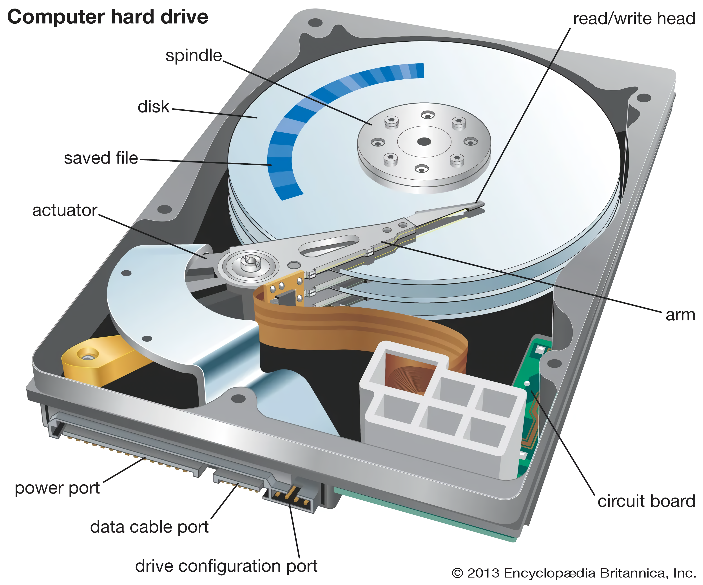

# Chapter 3: QEMU

## BIOS (Basic I/O System)

The Intel 8086 processor can access up to 1 MB of memory, 
with address ranges from `0x00000` to `0xFFFFF`.
However, this 1 MB is not exclusively allocated to DRAM (Dynamic Random Access Memory).
The architecture of the Intel 8086 divides the memory into two primary segments:

| Memory Range      | Device                                 |
|-------------------|----------------------------------------|
| `0x00000-0x9FFFF` | Dynamic Random Access Memory (DRAM)    |
| `0xF0000-0xFFFFF` | Read Only Memory (ROM)                 |

In the Intel 8086 processor, the memory is segmented into distinct
areas over its 1 MB addressable space. DRAM (Dynamic Random Access Memory)
is mapped to the lower 640 KB, from address `0x00000` to `0x9FFFF`.
The upper 64 KB, from `0xF0000` to `0xFFFFF`, is designated for
Read Only Memory (ROM), typically containing the system's firmware.
The middle region between these areas is reserved for external devices,
which will be discussed in more detail later.

When the Intel 8086 processor initializes, the Code Segment (CS) register is set to
`0xFFFF` and the Instruction Pointer (IP) register to `0x0000`.
Consequently, the address for the first instruction to be executed is
calculated by the processor as `0xFFFF0` (`0xFFFF` shifted left by 4 bits plus `0x0000`),
which falls within the ROM area in the upper 64 KB of the memory map.
This ensures that the 8086 starts executing from a fixed, read-only location,
typically where the system's firmware or bootstrap loader is stored.

## Hard Disk Drive, HDD

A hard disk drive (HDD), or hard disk, is a storage device used to store 
substantial amounts of data.

### Hard Disk Internal Layout

Below is an image depicting the internal structure of a hard disk:

<div style="text-align: center;">
  
</div>

As illustrated, a hard disk consists of one or more metal disks mounted on a motor.
Additionally, the "head," which reads and writes data, is attached to a metal arm,
powered by a separate motor.

The disk motor operates at a constant speed, which varies among different disks.
Typically, the speed ranges from $5,400$ to $7,200$ RPM (Revolutions Per Minute).
However, some disks achieve speeds of $10,000$ RPM or even $15,000$ RPM.
These high-speed disks are generally designed for high-performance applications,
primarily in server environments.

#### Head

Each disk inherently features two sides, and accordingly, there are two heads
per disk. These heads are systematically labeled from the top to bottom,
starting at 0 and increasing sequentially: 0, 1, 2, 3, and so forth.

All the heads are grouped together, and when the head motor operates,
it moves all the heads simultaneously to the same position.

#### Track and Cylinder

When the disk spins and the head remains in a fixed position above the disk,
the path scanned by the head creates a loop. This path is referred to as a
**track**. Since all heads move in unison, the tracks aligned at the same
position collectively form what is known as a **cylinder**.

> **Note:** Each track and cylinder is assigned a unique index number,
> starting from 0 and increasing incrementally from the outer edge of
> the disk towards the center.

**Cylinder** is a concept designed to optimize I/O speed.
The ideal I/O pattern involves maintaining the head position as much as possible,
as seeking time for the head is generally extensive, particularly when data is
dispersed across the disk. Data should be distributed across different tracks
that are positioned at the same cylinder, ensuring optimal access efficiency.

#### Sectors

Each track is divided into atomic units known as sectors.
The number of sectors per track can vary according to the manufacturer's design,
but it is commonly 63 sectors. Typically, each sector has a capacity of 512 bytes.
**Notably, each sector is also assigned an index number which, in a departure from
the usual convention, begins at ***1*** rather than *0*.**

A sector begins with the sector header, which contains crucial information for
the disk's microcontroller, including the current **head**, **track**, and
**sector** number. This header also includes various flags that indicate
the health and functionality of the sector.

Additionally, the video below demonstrates the startup
and shutdown processes of a hard disk:

<div style="text-align: center;">
    <iframe src="https://www.youtube.com/embed/TqV8AO57LQc?autoplay=1&loop=1&mute=1" width="800" height="450">
        HDD Startup and Shutdown
    </iframe>
</div>

## Cylinder 0, Head 0, Sector 1

After the initialization process in ROM-BIOS, the code in ROM-BIOS will attempt
to jump to an area specified in the BIOS settings (boot device). When the BIOS
is configured to boot from a hard disk drive, the first 512 bytes of the hard
disk—specifically from Head 0, Cylinder 0, Sector 1, known as the *boot sector*—are
loaded into memory at the address `0x0000:0x7c00`. This address is chosen based on
historical conventions and design decisions from the early days of computing.

## Logical Block Address, LBA

CHS (Cylinder, Head, Sector) mode, although already considered a legacy system
by the 1990s, proved challenging to operate due to its complexity.
To address these issues, the **Logical Block Addressing** (LBA) system was developed.
LBA simplifies addressing by linearizing the disk's geometry into a
single addressable space. LBA is a linear addressing scheme, which means it
maps disk data in a continuous range of logical block addresses, making hardware
details like cylinder, head, and sector invisible to the user or operating system.
This simplifies storage management and is especially useful as disk storage
technology evolves and becomes more complex.

> **Note:** LBA (Logical Block Addressing) assigns a linear block address,
> where the size of each block is predefined, typically set to 512 bytes.

The calculation for LBA is as follows:

$$\text{LBA} = (\text{Cylinder} \times \text{HeadCount} \times
\text{SectorCountOnTracks}) + (\text{Head} \times \text{SectorCountOnTracks}) +
(\text{Sector} - 1)$$

**where**

- **Cylinder**: The cylinder number.
- **HeadCount**: The total number of heads in the disk.
- **SectorCountOnTracks**: The number of sectors per track.
- **Head**: The current head number.
- **Sector**: The current sector number (note that sector indexing typically starts at 1, which is why the formula subtracts 1).

### Example:

**Disk Geometry:**
- Total Cylinders: 1000
- Heads per Cylinder: 10
- Sectors per Track: 50

**Random Location (CHS):**
- Cylinder: 500
- Head: 5
- Sector: 25

$$\text{LBA} = (500 \times 10 \times 50) + (5 \times 50) + (25 - 1)$$

$$\text{LBA} = 250,000 + 250 + 24 = 250,274$$

## Main Boot Sector (MBR)

### Text Mode
The default resolution for BIOS text mode is set at 25 rows by 80 columns,
which allows for a display of 2,000 characters on the screen. In this mode,
the Video RAM (VRAM) is mapped to the memory range `0xB8000` to `0xBFFFF`.

A valid character in this context is represented by 16-bit data, consisting
of two parts. The first part is the 8-bit ASCII code, which identifies the
specific character displayed. The second part is an 8-bit attribute code,
formatted as `KRGBIRGB`, which determines the visual attributes such as color
and blinking of the character.

| Bit Pattern | Attribute               | Description                                             |
|-------------|-------------------------|---------------------------------------------------------|
| K           | Blink/Bright Background | 0 = No Blink, 1 = Blink or Bright Background (varies)   |
| RGB         | Background Color        | Sets the background color using RGB values              |
| I           | Foreground Intensity    | 0 = Normal, 1 = High Intensity/Bright                   |
| RGB         | Foreground Color        | Sets the foreground color using RGB values              |

Let's write an example program that display an 'A' on the screen:

```nasm
[bits 16]           ; 16-bit mode
[org 0x7C00]        ; Boot sector loads at 0x7C00

    ; set extra segment
    mov ax, 0xB800
    mov es, ax
    
    ; set the first character on screen as A with
    ; green text and blue background 
    mov byte [es:0x0000], 'A'
    mov byte [es:0x0001], 0x9A
    
    jmp $           ; infinite loop, so the processor don't wonder off
```

That's good, but, for a BIOS to recognize that MBR is bootable, the last two digits
of the sector must be `0x55` and `0xAA`. Therefore, we have to add a bit more lines:

```nasm
    times 510-($-$$) db 0
    dw 0xAA55
```

The line `times 510-($-$$) db 0` in NASM assembly code serves as a method
to fill a specific amount of space with zeros, up to a specified offset
within the assembly code file. Here's a breakdown of each component in the
line to clarify its function:

1. **`times`**: This is a NASM directive used to repeat the following
                instruction or data declaration a specified number of times.

2. **`510-($-$$)`**: This is the expression that calculates how many times
                     the following data declaration should be repeated.
    - **`510`**: This represents the total number of bytes that should precede
                 the boot signature in the boot sector. Since the boot signature
                 should be at byte 510 and 511 in a 512-byte boot sector, you start
                 filling from byte 0 up to byte 509 with the actual boot code or
                 padding.
    - **`$`**: This is a special NASM symbol that represents the current assembly
               position as an offset from the start of the section.
    - **`$$`**: This is another special NASM symbol that represents the start address
                of the current section (in this case, set by `ORG 0x7C00`).
    - **`$ - $$`**: This calculates the current offset in bytes from the start
                    of the section.
    - **`510-($-$$)`**: The result of this expression tells NASM how many bytes of
                        padding are needed to reach the 510th byte.

3. **`db 0`**: This declares a byte of data with the value `0`.
               Combined with the `times` directive, it fills the calculated number
               of bytes with zeros.

### Debug


---

[Chapter 4]()

[Back To Main Page](../README.md)
