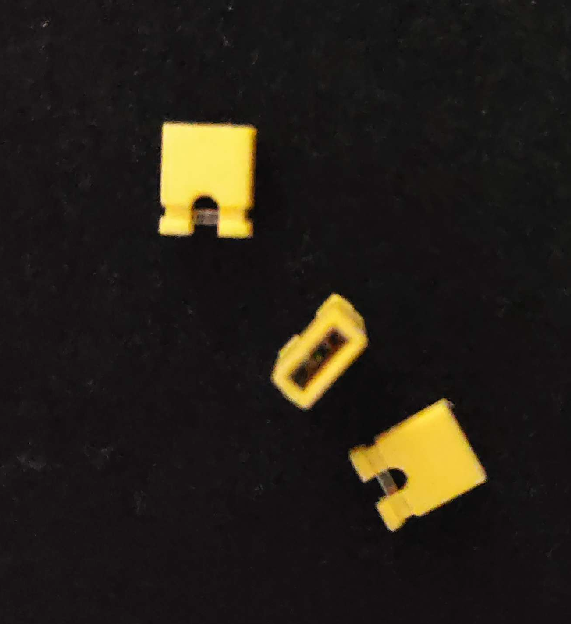
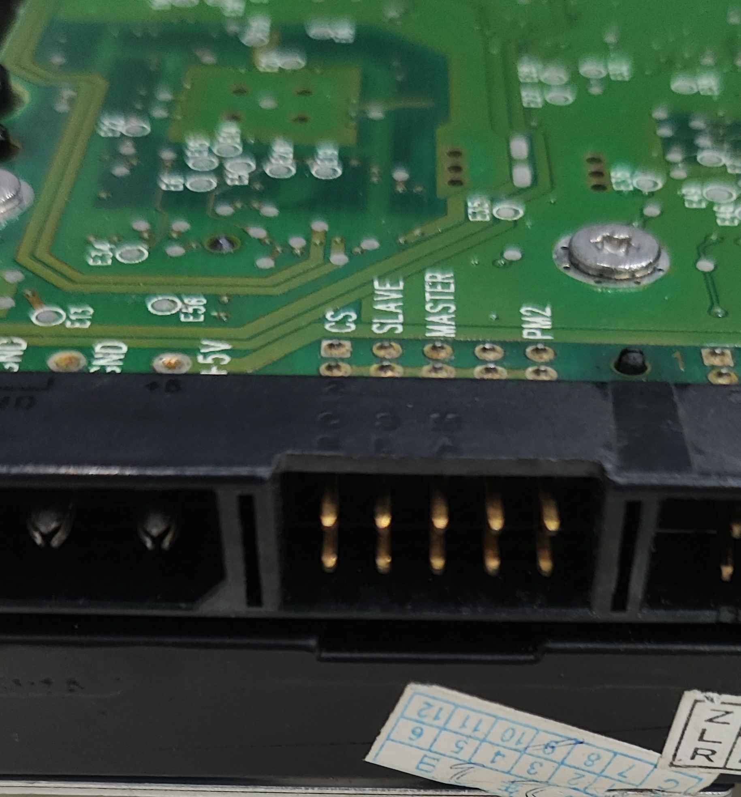
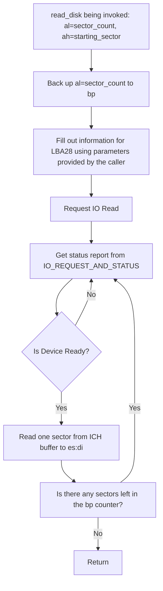
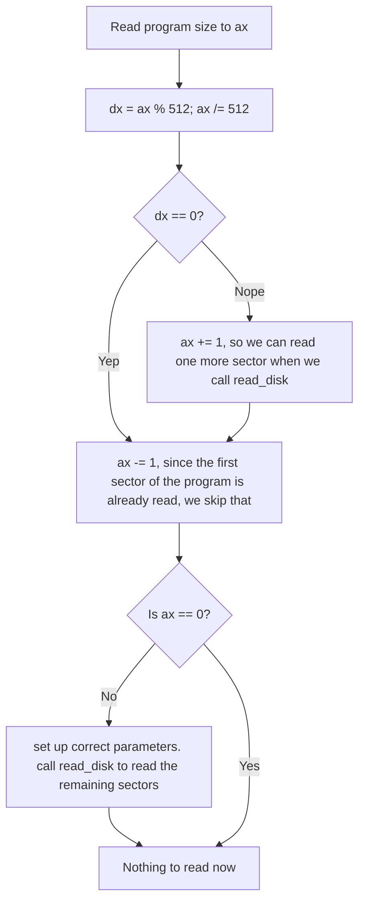
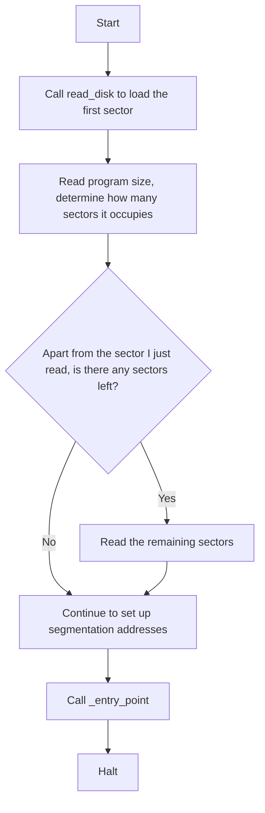
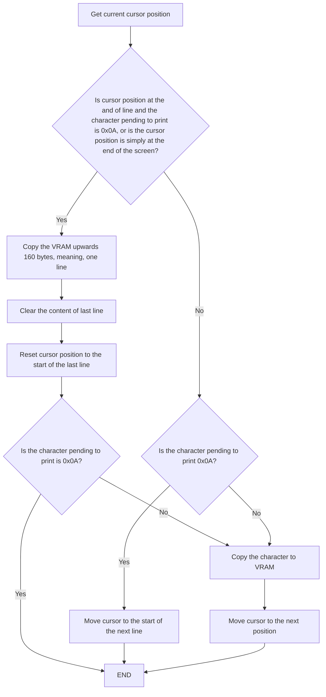

# Chapter 4: Disk Operations and Program Relocation

The boot sector has a maximum size of 512 bytes.
Thus, any complicated programming is off the table, not even with assembly.
More than often, it only serves as a loader to load more complicated programs into memory.
These programs are not necessarily operating system kernels but can be sophisticated tools like advanced
bootloaders (that load other more complicated programs, again, not necessarily operating system kernels. Yeah, I know).

Now, this chapter is one of those that is long and tedious, and potentially confusing.
I'll try my best to negate all these factors, but if they still persist, I apologize in advance.

In this chapter, we have the following goals to achieve:

1. Access hardware beyond processor scope.
2. Program loading process that demonstrates the relocation of segmentations.

The Master Boot Record (MBR) we attempt to write this time is a loader that loads the program starting at the next sector.
But first, we need to know how to operate IDE/ATA Hard Disks using I/O Ports on CPU to read specific data.

## Read From a Disk

Line 1 to 5 starts as usual, we define offset to be `0x7C00`, starting as 16bit mode, and jump to start label.
But right after that, we defined the following constants:

```nasm
  6  IO_PORT                 equ 0x1F0
  7  IO_ERR_STATE            equ 0x1F1
  8  IO_BLOCK_COUNT          equ 0x1F2
  9  IO_LBA28_0_7            equ 0x1F3
 10  IO_LBA28_8_15           equ 0x1F4
 11  IO_LBA28_16_23          equ 0x1F5
 12  IO_LBA28_24_27_W_4_CTRL equ 0x1F6
 13  IO_REQUEST_AND_STATE    equ 0x1F7
 14  
 15  IO_READ                 equ 0x20
```

### Instruction `in` and `out`

Before we delve into the meaning behind these constants, we have to understand two instructions: `in` and `out`.
`in` reads data from a port on CPU, and `out` outputs data to a port.
Different from the registers inside CPU, these ports, or pin, connects to external hardware beyond CPU scope.
We can have a look with the picture of an old 80386 CPU silicon die
(a piece of flat, usually square, silicon with circuits on it)
taken by Ken Shirriff, who has vast knowledge on these old school pieces of hardware:
<div style="text-align: center;">
    
</div>

The bond wire provides a connection between the silicon die and the external hardware,
and usually exposes itself as a pin (golden spike) outside the chip package.

Each communication port has a specific address to identify themselves, like the port numbers listed from line 6 to 13.
CPU sends and receives data using `in` and `out` instructions, which only takes `al` or `ax` to store the 8bit or 16bit data to send or receive,
and uses `dx` or constants to specify the port, meaning:

```nasm
    in  ax, dx      ; read 16bit width data from port number in dx to ax
    in  al, 0x37    ; read 8bit width data from port 0x37

    out dx,   al    ; output 8bit data in al to port number in dx
    out 0x37, ax    ; output 16bit data in ax to port 0x37
```

> **Important Note:** While `dx` can specify port addresses up to 16-bit width,
> constants on the other hand, **can only address 8-bit port addresses**.
> It means ```in al, 0x1F0``` is ***NOT*** a valid operation,
> but NASM **might *still* allow it** in the compilation process, which it really shouldn't.
> Do be cautious, and pay attention to the warning messages.
> > I know people ignore warning messages a lot. However, warning messages can be potential Bugs.
> > Now, when in GCC, forced data type conversion (C style conversions in C++) will generate a lot of warning messages, as well as temporary hacks.
> > The code we are using will generate warning messages, like reserved space. But, it doesn't mean that all the warning messages are meaningless.
> > A 16-bit to 8-bit data conversion causing overflow will be warned by NASM, and you have to pay special attention to these.

Unlike microprocessors, these pins on CPU are not connected to the hardware like hard disk or GPU directly.
They are connected to what we know as Input and Output Controller Hub (Bridge), or ICH (Bridge).
CPU connects itself to ICH, and ICH then connects itself to Bus.
Bus is a huge cable line consisting of multiple cables, where ultimately all external devices, like sound cards, GPUs, keyboards, connect.

We explain each port as we go.

### Read From Hard Disk

Reading from hard disks consists of multiple steps:

#### Step 1: specify the disk sectors I'd like to read

```nasm
 17  start:
 18      ; Step 1: Set number of the blocks/sectors pending to read
 19      mov     al,     0x01                ; 1 block/sector
 20      mov     dx,     IO_BLOCK_COUNT      ; set out port
 21      out     dx,     al
```

As you can see, we first load `IO_BLOCK_COUNT` port address into `dx`, then load the sectors we want to read into `al`.
Since it is an 8-bit port, the maximum sectors we can read at one time are 256.

> **Note:** You may ask: why not 255? Here is its logic in C:
>
> ```c++
>   uint8_t sector_count = 0x00;
>   do {
>       /* Read Operation */
>   } while (--sector_count != 0);
> ```
>
> Since the microprocessor does a ```--sector_count``` first, which is basically a `dec` instruction,
> the original `0x00` becomes `-1`, which is an overflow.
> This overflow causes the 8-bit register to become `0xFF`, which is `255` in decimal, then continuing
> decreasing until it becoming `0`, which is when the operation ultimately finishes.
> As a result, we can ultimately read 256 sectors in total.
> However, depending on the vendors, this might not be true.
> Consider this as a hack, and a hack is never recommended and only supposed to serve as a temporary solution (unless, of course, you are writing Linux kernels).

#### Step 2: Specify the Starting Sector/Block Desired to Read

We have covered LBA before, it is a logic block addressing mode in hard disks.
Now, LBA has multiple different standards, which mainly have the differences in the addressing width.
A simple LBA addressing mode is 28 bits in width.
Twenty-eight bits gives us $2^{28} \times 512 = 268,435,456 \times 512 = 137,438,953,472 = 128 \text{GiB}$ accessible disk space.
Remember, that was an era where owning a 2 GiB disk is considered rich, 128 GiB is usually unheard of.
Technology quickly evolves, normally we use 48-bit LBA mode to manage our disks now.
LBA 48 gives us $2^{48} \times 512 = 128 \text{PiB}$ manageable disk, equaling to $134,217,728$ GiB addressable disk space,
which is unheard of for personal use as of December 4th, 2024.

> **Note:** I know I use GB and GiB interchangeably, but in storage, GB and GiB are two different units.
> And by default, when I say GB, I mean GiB.
> I don't know why people tend to use that "GB" instead of GiB since that unit makes little sense to me.
> When we use "GB" instead of GiB, the calculation becomes: 1 GB = 1,000,000,000 bytes ($10^9$)
> (While 1 GiB = $1 \times 1024 \times 1024 \times 1024$ Bytes, which is what I always use).
> This might make sense to common users that are not programmers, but it causes a lot of inconveniences in code.
> This unit makes LBA28's addressable space become 137.438 GB instead of a sensible integer (128).
> CPU is terrible, very imprecise, and resource-demanding when it comes to floating-points.
> That's why we tend to avoid that.

Now, we set the start block in LBA28.
The configuration is simple: we'd like to read the first block.
Since LBA starts from 0, the number is `0000 0000 0000 0000 0000 0000 0001`, which is, well, 1.
Now, `IO_LBA28_0_7`, `IO_LBA28_8_15`, `IO_LBA28_16_23` are easy to understand.
They are 8-bit width ports, and correspond to the bits in LBA28.

`IO_LBA28_24_27_W_4_CTRL`, however, is a bit different (four bits different, actually).
The following table is its higher four bits:

| 7 | 6              | 5   | 4                   |
|---|----------------|-----|---------------------|
| 1 | CHS=0<br>LBA=1 | 1   | Master=0<br>Slave=1 |

The lower four bits are used for LBA28 addressing, but the higher four bits are used for configuration.
We ignore the seventh and fifth bit for now, which is always 1 in our cases.
The configuration bit we actually want to pay attention to is the sixth and fourth bit.
The sixth bit sets our addressing mode, which, in our case, should be 1 (LBA).
The fourth bit is the disk we want to read.
IDE controller allows us to mount two disks on one cable.
When two disks are mounted simultaneously, one should be configured as "Master," and the other as "Slave."
(Seriously, I know a BDSM play when I see it).

The configuration for the higher bits should be `1110`, which stands for `[1] [LBA=1] [1] [IDE Master Disk=0]`,
LBA mode, read from IDE Master disk.

> A bit of information here: When you config the IDE disks, you actually have to wire two pins on the disk
> to tell the controller who is Master and who is Slave.
> There are these small devices called jump wires, as shown below:
>
> 
>
> These are female-female jump wires, connecting two male pins.
> 
> 
> 
>
> The pins on the disk are two male pins (pins that poke out).
> ~~(On a total side note, whoever came up with these names is a real legend.)~~

**Set up LBA28:**

```nasm
 23      ; Step 2 : Set the start block of LBA28
 24      mov     al,     0x01                ; second block, LBA starts from 0
 25      mov     dx,     IO_LBA28_0_7
 26      out     dx,     al
 27  
 28      xor     al,     al
 29      mov     dx,     IO_LBA28_8_15
 30      out     dx,     al
 31  
 32      mov     dx,     IO_LBA28_16_23
 33      out     dx,     al
 34  
 35      mov     al,     11100000B           ; 1 [LBA=1/CHS=0] 1 [IDE Master=0/IDE Slave=1] 0 0 0 0
 36      mov     dx,     IO_LBA28_24_27_W_4_CTRL
 37      out     dx,     al
```

#### Step 3: Request ICH to Read

Now that we have written the relevant information to the controller, we can tell the controller that we'd like to read some data from the disk.

```nasm
 39      ; Step 3: Request ICH I/O Read
 40      mov     dx,     IO_REQUEST_AND_STATE
 41      mov     al,     IO_READ
 42      out     dx,     al
```

By writing to the port `IO_REQUEST_AND_STATE` with `IO_READ`, we just requested the controller to read the disk.

#### Step 4: Wait for Disk to Finish Operation

`IO_REQUEST_AND_STATE` is both an output port and an input port.
That's why we call it "IO_REQUEST_AND_STATE," it outputs IO request and gets IO state.
Now, there are only three bits we are interested in: seventh, third, and zeroth, and they are `BSY`, `DRQ` and `ERR`.

| 7   | 6 | 5 | 4 | 3    | 2 | 1 | 0   |
|-----|---|---|---|------|---|---|-----|
| BSY |   |   |   | DRQ  |   |   | ERR |

When `BSY` is `1`, controller tells CPU that it is busy reading data, and is not ready to exchange data.
When `DRQ`, which stands for `Data Request`, is `1`, and `BSY` is `0`,
ICH indicates that the controller is done reading and is ready to exchange data.
So, we have to wait until that happens.

> **Important Note:** You have to wait for the operation to complete for every single sector!
> Otherwise, the input port will provide a bunch of zeros.

```nasm
 44      ; Step 4: Wait for the operation to finish
 45      .wait_for_disk_ops:
 46          in          al,         dx
 47          and         al,         10001000B
 48          cmp         al,         00001000B
 49          jne         .wait_for_disk_ops
```

The above code ignores error handling for simplicity.
Now, if you do encounter an error, `ERR` will be marked as `1` and `IO_ERR_STATE` will provide the error code.
The error code varies across different systems; the following is only a reference.

| **Bit** | **Name**                       | **Description**                                                                |
|---------|--------------------------------|--------------------------------------------------------------------------------|
| **0**   | ABRT (Abort)                   | Command aborted by host.                                                       |
| **1**   | TK0NF (Track 0 Not Found)      | Track 0 not found.                                                             |
| **2**   | AMNF (Address Mark Not Found)  | Address mark not found; data integrity issue.                                  |
| **3**   | TKONF (Track Overflow)         | Track overflow detected; head moved beyond cylinder boundary.                  |
| **4**   | CRC (CRC Error)                | CRC error in data transfer; indicates data corruption during transfer.         |
| **5**   | ICRC (Interface CRC Error)     | CRC error in the interface; communication error between controller and device. |
| **6**   | UNC (Uncorrectable Data Error) | Uncorrectable data error; severe data corruption.                              |
| **7**   | BBK (Bad Block Detected)       | Bad block detected on the media; physical sector damage.                       |

#### Step 5: Read Data from Buffer

##### Step 5.1: Prepare My Own Buffer Space in Memory (Optional)

Read operation is quite simple. Here we first set up our buffer inside the memory:

```nasm
 51      ; Step 5: Read the Data from Buffer
 52      ; 1. Setup DS:SI
 53      xor     ax,     ax
 54      mov     ds,     ax
 55  
 56      mov     si,     _buffer
```

##### Step 5.2: Read Data

Now, we attempt to read.
The input port, `IO_PORT`, is actually 16-bit width.
So, to read 512 bytes of data, we actually only need to repeat the operation 256 times.

```nasm
 58      ; 2. Read
 59      mov     cx,     256                 ; the I/O port is 16-bit width, meaning 512 bytes is 256 words
 60      mov     dx,     IO_PORT
 61  
 62      .iteration_loop_read_word_from_disk:
 63          in          ax,         dx
 64          mov word    [ds:si],    ax
 65          add         si,         2       ; 2 bytes, 1 word
 66  
 67          ; loop logic is similar to do { ... } while (--cx != 0)
 68          loop .iteration_loop_read_word_from_disk
```

The `loop` instruction operates like this:

```nasm
    .loop:
        ; Operation that I want to do
        dec cx
        cmp cx, 0
        jne .loop
```

which is similar to what I wrote in the comments in C. `loop` is just a simpler version of the above code.

And, just like that,
we have walked through the whole process of reading a sector from the hard disk using the IDE controller.
Actually, ATA controllers are supposed to behave the exact same.

#### Print the Data (Optional)

Below is a code that we don't have to fully understand right now.
It uses a BIOS print call to print the character right at the cursor's location.
We will talk about how to manipulate cursor location and communicate with GPU directly
without the involvement of BIOS interruption calls or any third party software.

A simple explanation here is that by setting `ah` to `0x0E`, and use the interruption instruction `int 0x10`,
we just told BIOS to print the content in `al`, which is an ASCII code, on screen, right at where cursor is,
and move the cursor to the position of the next character.

> ***A quick explanation here:** Interruption is somewhat like a function call,
> but the actual jump sequence is handled by hardware. We don't need to know where this function is actually
> located in memory, we can just call it without that knowledge.
> When an interruption is performed, the current task is actually halted during the handling.*

```nasm
 70      ; Now, we print it to the screen
 71      mov     si,     _buffer
 72      .print:
 73          cmp byte    [ds:si],    0x00
 74          je          .end
 75  
 76          mov         ah,         0x0E    ; TTY Output Function
 77          mov         al,         [ds:si] ; Character to print
 78          int         0x10                ; Call BIOS interrupt
 79          inc         si
 80  
 81          jmp         .print
 82      .end:
```

And below, we have the good old halting the system, so the processor doesn't wonder off and execute code we
don't want to execute.
Also, we defined the buffer here so the data we just read are put right after the MBR code.
And the boot signature, of course.

```nasm
 84      ; halt the system
 85  _infinite_loop:
 86      hlt
 87      jmp _infinite_loop
 88  
 89  _buffer:
 90      times 510-($-$$) db 0
 91  
 92  ; Boot signature
 93  dw 0xAA55
```

### Disk Sector 2

There's nothing really important inside the second disk sector, just a string "Hello, World!" with a null terminator.

```nasm
[bits 16]          ; 16-bit mode

db "Hello, World!", 0
```

## Program Relocation

Like I said before, 512 bytes can do very limited tasks.
The only thing it usually performs is actually loading a much bigger program into the memory.
In this section, we will cover the concept of a program loader, and how to effectively use segmented code
in NASM to write a relocatable program.

Now, there are a couple of things that are actually challenging when we want to load a program:

On the loader's side:

1. The program's size is unknown.
2. Where does the program begin to execute? We can't just assume `0x0000`, right?

On the program's side:

1. How do I determine the location of my data segmentation in the memory without hardcoding it?
2. How do I effectively reserve stack segmentation in memory without knowing which part is free?

To address the unknown, we must provide something known on both the loader's side and on the program's side.
And, that is where the concept of program head comes in:

### Program Head

A program head is a descriptive structure that tells the essential information the loader wants to know.

Below is the program head we use.
There are a couple of things we need to know:

- **`segment` is used to define a segment (obviously).** Its grammar is `segment [Segmentation Name] align=[alignment] vstart=[Starting Address]`
  - You need to provide a segmentation name, otherwise this segmentation is meaningless.
  - **`align` specifies the code alignment.**
      Why is this important?
      Because of segmented addressing.
      Each segmentation needs to be in the alignment of 16, which is 0x10.
      Should segmentation start at 0x1234 in the absolute address in the source code,
      then the segmentation address is, at best, 0x123:0x04.
      This will unnecessarily add some extra work to load and relocate our program.
  - **`vstart` defines the starting offset of current section label.**
      It overrides the previous section labels, and its effective range stops when the next segmentation begins.
      If no `vstart` is provided, the code offset falls back to the default one provided by the `org`, or `0` if
      none is provided.

```nasm
8   segment head align=16 vstart=0
9       dw _program_end                         ; program length                                    +0
10      dw _entry_point                         ; program entry point(index) in code segmentation   +2
11      dw _data_start                          ; data segmentation start point                     +4
12      dw _data_end                            ; data segmentation end point                       +6
13      dw _code_start                          ; code segmentation start point                     +8
14      dw _code_end                            ; code segmentation end point                       +10
15      dw _stack_start                         ; stack segmentation start point                    +12
16      dw _stack_end                           ; stack segmentation end point                      +14
```

Now, effectively we just defined a data structure at the start of the program.
Its internal structure and its location are known to both loader and the program.

### Load the Whole Program into the Buffer

Take a look at the loader.
The previous steps are similar to the reader, except that we made it a function so that we can reuse this reader.
`read_disk(al=sector_count,ah=starting_sector)` reads from Master disk and store the data inside `es:di`,
which should be set up in advance by the caller.

```nasm
17  read_disk:  ; read_disk(al=sector_count,ah=starting_sector) => es:di
18      pusha
19      ;;;;;;;;;;;;;;;;;;;;;;;;;;;;;;;;;;;;;;;;;;;;;;;;;;;;;;;;;;;;;;;;;;;;;;;;;;;;;;;;;;;;;;;;;;;;;;;;;;;;;;;;;;;;;;;;;;;;
20      ; we preserve the number of sectors to read to bp
21      mov         bx,                     ax
22      xor         bh,                     bh
23      mov         bp,                     bx
        ; .............
44      ; Step 4: Read the Data from Buffer
45      ; Step 4.2. Read
46      ; bp contains the sector count we set at the start of the function
47      .iteration_loop_read_word_from_disk:
48      ; Step 4.2.1: Wait for the operation to finish !! We do this for each sector !!
49      mov         dx,                     IO_REQUEST_AND_STATE
50      .wait_for_disk_read_ops:
51          in          al,                 dx
52          test        al,                 DRQ                             ; performs a bitwise AND check
                                                                            ; and see if Zero Flag (when result == 0) is set
53          jz          .wait_for_disk_read_ops

54          ; here is the sub loop body, for simplicity we use cx+loop instruction
55          mov             cx,                     256                     ; we read one sector and one sector only
56          mov             dx,                     IO_PORT                 ; set dx to IO port
57          .read_sector:
58              in          ax,                     dx                      ; read from IO port
59              mov word    [es:di],                ax                      ; write to buffer
60              add         di,                     2                       ; 2 bytes, 1 word
61          ; loop logic is similar to: do { ... } while (--cx != 0)
62          loop            .read_sector

63          dec             bp                                              ; decrease bp
64          cmp             bp,                     0x00                    ; compare bp to 0
65          jne             .iteration_loop_read_word_from_disk             ; if bp != 0, repeat, if bp == 0, continue downwards
            ; .............
```

There are things here and there that we are not entirely familiar with. I will explain:

- First, the `test` and `jz` instructions.
    `test` performs a bit and between its two operands.
    `jz` performs a conditional jump
    when CPU `ZF`, Zero Flag, is set.
    Effectively, we just simplified our code from

    ```nasm
        continue:
            in  al, dx          ; read from port
            and al, 0x80        ; clear all bits but DRQ
            cmp al, 0x00        ; compare al to 0x00
        je continue             ; if al == 0x00, jump, if DRQ bit is set, continue 
    ```

    to

    ```nasm
        continue:
            in   al, dx
            test al, 0x08
        jz continue
    ```

    You may say one less instruction is kinda geeky.
    Yeah, I agree.
    However, the boot sector is a tiny space, and sometimes we really need to obscure our code to squeeze in.
    It might read like gibberish, but still better than Adobe code.
- Like what we have discussed before, you have to wait for the ICH to read for each sector.
    Otherwise, among our actual data, there might be a bunch of zeros pops up from nowhere.

To clarify, I draw the diagram to explain `read_disk(al=sector_count,ah=starting_sector)=>es:di`:



Continuing on, the loader first reads the second sector, which is where the program is located,
and then determines the size of the program.
It then continues to read any remaining sectors, if there is any: 

```nasm
68      ;;;;;;;;;;;;;;;;;;;;;;;;;;;;;;;;;;;;;;;;;;;;;;;;;;;;;;;;;;;;;;;;;;;;;;;;;;;;;;;;;;;;;;;;;;;;;;;;;;;;;;;;;;;;;;;;;;;;
69  start:
        ; set up es:di and read the first sector...
76      ; now, we determine how large the program is:
77      mov         ax,                     [es:di]                         ; first value is the actual program size
78      ; now that ax is the actual program size, we determine how much sectors it occupies
79      xor         dx,                     dx
80      mov         bx,                     512
81      div         bx
82      ; we see if dx is zero, if not, we add one more sector to read
83      cmp         dx,                     0x00
84      je          .skip_add_sector
85      ; if the program occupies more data but not a full sector, we have to manually add one more sector to read
86      inc         ax
87      .skip_add_sector:

88      ; since we have already read the second sector, we skip that and move buffer offset to new location
89      add         di,                     512
90      dec         al
91      mov         ah,                     2                               ; read starting from the third sector
92      cmp         al,                     0                               ; compare number of the pending sector to read to 0
93      je          .end_read                                               ; we have no sector to read, skip (program size < 512 B)
94      call        read_disk                                               ; if we still have sectors to read, continuing on
95      .end_read:
```



### Setup Correct Registers for Program

Now that we have already read the whole program, it's time to set up:
 - Data segmentation
 - Stack segmentation, with SP being $\text{reserved stack segmentation end point} - \text{start point}$.
 - Code segmentation

```nasm
96      ; we have already read the whole program, now we need to reset our buffer offset
97      mov         di,                     _buffer - SYS_STARTINGPOINT

98      ; Now, we relocate the user program. The allocation is hardcoded for simplicity
99      ; new_seg_addr = cur_seg + (cur_index + off_in_prog) >> 4

100     ; set stack segmentation
101     mov word    ax,                     [es:di + 12]                    ; stack segmentation starting address
102     add         ax,                     di
103     shr         ax,                     4
104     add         ax,                     0x07C0
105     mov         ss,                     ax

106     mov word    ax,                     [es:di + 12]                    ; stack segmentation starting address
107     mov word    bx,                     [es:di + 14]                    ; stack segmentation end address
108     sub         bx,                     ax
109     mov         sp,                     bx

110     ; set up data segmentation
111     mov word    ax,                     [es:di + 4]                     ; data segmentation starting address
112     add         ax,                     di
113     shr         ax,                     4
114     add         ax,                     0x07C0
115     mov         ds,                     ax
116     xor         si,                     si

117     ; attempt to call _entry_point() with correct code segment (offset starts with 0x0000)
118     mov         bx,                     [es:di + 2]                     ; get entry point offset
119     mov         ax,                     [es:di + 8]                     ; get code segmentation starting address
120     add         ax,                     _buffer                         ; pending the current buffer segment
121     shr         ax,                     4                               ; they are all flat address, so we shift 4 bits to the right

122     ; Now we clear es to 0, so that we can access our own data section.
123     ; with ds now point to the program's own data section, our default
124     ; data addressing is now invalid! Luckily, MBR code position is known
125     ; so we can override with known values, in this case, the easiest one is
126     ; to just use '0x00'
127     xor         cx,                     cx
128     mov         es,                     cx

129     ; to perform a long call, we need to provide both Code Segmentation address for CS, and offset index for IP
130     ; Now that call doesn't accept register combination for long call, we use memory instead
131     ; the memory map should look like this: offset, segmentation.
132     mov         [es:_far_call],         bx                              ; offset
133     mov         [es:_far_call+2],       ax                              ; segmentation

134     call far    [es:_far_call]
```

Nothing too crazy, but there are things that need explanation:

#### New Segmentation Address Calculation

$$\text{NewSegmentationAddress} = \frac{\text{CodeStartingPointInMemory} + \text{AbsoluteAddressInCode}}{16} + \text{0x07C0} $$

where
- `NewSegmentationAddress` is, well, new segmentation address
- `CodeStartingPointInMemory` is where the code is loaded to.
   Note that since this will be part of the segmentation address calculation, it must be 16-byte aligned.
- `AbsoluteAddressInCode` is the absolute offset in source code (starting from `0`, start of the source to, to the current location).
- `0x07C0` is where the loader's segmentation is. This is hardcoded.

#### Far Call (Absolute Address Call)

We don't set up `CS` and `IP` manually.
Modifying CS directly leads to nothing good.
And modifying `IP` manually is not allowed.
Luckily, we have far call.

```nasm
    call far [rm]
```
`[rm]` means, the operand is either a register that provides a memory address, or is an address itself, overridable with
general segmentation registers.

`call far` locates that memory address, then read two 16-bit data from it.
Load these two data into `IP` and `CS` respectively, and pushes the original `CS:IP` into the stack.

| Data Address Offset | Meaning                   |
|---------------------|---------------------------|
| +0                  | Code Index                |
| +2                  | Code Segmentation Address |

By using far call, we effectively modified `CS:IP` without actually touching the register.

```nasm
142 ; What does this do and why it's here? good question. This thing does one job, ensure alignment of _buffer without
143 ; having to setup a separate code segmentation that will messing with the code size
144 times 16 - (($ - $$) % 16) db 0
145 _buffer:
```

The reason why I didn't use segmentation is ~~due to lack of optimization and laziness~~
that I want to show how to ensure 16-byte alignment within code segmentation.
~~Now, if you really want to fill the code space with repetitive 8-bit data, 0x00 really is not a good choice.~~
~~Two bytes of 0x00 is actually `add byte ptr ds:[bx+si*1], al`.~~
~~If it got executed, the result is very unpredictable.~~
~~Fill it with 0x90, which is `nop`(No Operation). If it get executed, CPU does absolutely nothing.~~

Below is a diagram that illustrate the whole process of a loader:



## User Program And GPU Register Manipulation

### GPU Registers

GPU is really complicated hardware, much, much, much more complicated than CPU.
This stays true even back in the 90s.
Now, here we only talk about two IO ports and two registers.

GPU allows CPU to access its own registers directly, but only through pointer/index.
We write the index addresses, like `GPU_CURSOR_H8_BIT`, to `GPU_REGISTER_INDEX`,
then read/write the registers through `GPU_INDEXED_REG_IO`.

```nasm
3   GPU_REGISTER_INDEX      equ 0x3d4
4   GPU_CURSOR_H8_BIT       equ 0x0e
5   GPU_CURSOR_L8_BIT       equ 0x0f
6   GPU_INDEXED_REG_IO      equ 0x3d5
```

### Segmentation Identifiers

Segmentations `_code_head`, `_code_tail`, `_data_head`, `_data_tail`, `_stack_reserved`, and `tail` has no `vstart`,
meaning the labels
`_code_start`, `_code_end`, `_data_start`, `_data_end`, `_stack_start`, `_stack_end`, and `_program_end`
are the absolute offset.
These labels are used to determine the exact size of each segmentation, though not all of them are used in the loader.

```nasm
19  segment _code_head align=16
20  _code_start:
; ...
231 segment _code_tail align=16
232 _code_end:

236 segment _data_head align=16
237 _data_start:
; ...
266 segment _data_tail align=16
267 _data_end:

271 segment _stack_reserved align=16
272 _stack_start:
273     resb 0x1FF
274 _stack_end:

277 segment tail align=16
278 _program_end:
280     times 16 db 0
```

### GPU Direct Access and Manipulation

Entry point is pretty simple: we call print to print out the content inside `ds:si`, and exit.
The logic of function print is pretty simple as well: We read from `ds:si` and see if the data we read is `0`.
If it is zero, then, being a null terminated string, this indicates the end of the string, thus return to the main function.
If not, then there are still data left inside `ds:si`, we continue output data using `putc(al=character)`.

#### GPU Get and Set Cursor Position

We use I/O port to access and manipulate GPU cursor position:

```nasm
175 get_cursor: ; get_cursor()->ax
176     push        dx
177
178     ; now, point the GPU register index to the cursor register (higher 8 bit)
179     mov         dx,         GPU_REGISTER_INDEX
180     mov         al,         GPU_CURSOR_H8_BIT
181     out         dx,         al
182
183     ; now, read from GPU register IO port, which is cursor register (higher 8 bit)
184     mov         dx,         GPU_INDEXED_REG_IO
185     in          al,         dx
186
187     mov         ah,         al
188
189     ; now, point the GPU register index to the cursor register (lower 8 bit)
190     mov         dx,         GPU_REGISTER_INDEX
191     mov         al,         GPU_CURSOR_L8_BIT
192     out         dx,         al
193
194     ; now, read from GPU register IO port, which is cursor register (lower 8 bit)
195     mov         dx,         GPU_INDEXED_REG_IO
196     in          al,         dx
197
198     pop         dx
199     ret
200
201 set_cursor: ; set_cursor(ax)
202     push        dx
203     push        bx
204
205     mov         bx,         ax              ; save ax to bx
206
207     ; now, point the GPU register index to the cursor register (higher 8 bit)
208     mov         dx,         GPU_REGISTER_INDEX
209     mov         al,         GPU_CURSOR_H8_BIT
210     out         dx,         al
211
212     ; now, read from GPU register IO port, which is cursor register (higher 8 bit)
213     mov         dx,         GPU_INDEXED_REG_IO
214     mov         al,         bh
215     out         dx,         al
216
217     ; now, point the GPU register index to the cursor register (lower 8 bit)
218     mov         dx,         GPU_REGISTER_INDEX
219     mov         al,         GPU_CURSOR_L8_BIT
220     out         dx,         al
221
222     ; now, read from GPU register IO port, which is cursor register (lower 8 bit)
223     mov         dx,         GPU_INDEXED_REG_IO
224     mov         al,         bl
225     out         dx,         al
226
227     pop         bx
228     pop         dx
229     ret
```

There's really nothing spacial to it, except for the meaning of the register.
`GPU_CURSOR_L8_BIT` and `GPU_CURSOR_H8_BIT` are the lower and higher 8-bit of cursor register.
The register contains the linear address of the cursor, meaning, for an 80x25 VGA analog display,
the register has the range of $ [0, 1999] $ ($ [0, 80 \times 25–1] $).

Now, the following code is very, well, not modular like. So I will again, draw a diagram of the process of `putc`.



The code is as following:

```nasm
22  segment code align=16 vstart=0
23  putc:   ; putc(al=character)
24      pusha                                   ; preserve state
25      push        ds
26      push        es
27
28      mov         bl,         al              ; save character to bl
29
30      ; get_cursor() -> ax
31      call        get_cursor
32
33      ; check if we have reached the bottom of the screen
34      ; when that happens, we first, need to move the content on the screen upwards one line (+80 characters)
35      ; first instance: last line and attempt a newline (ax >= 1920)
36      cmp         ax,         1920
37      jl          .end_of_scrolling           ; skip when ax < 1920
38      ; now ax >= 1920, skip if bl != 0x0A
39      cmp         bl,         0x0A
40      jne         .end_of_scrolling           ; skip if not a newline
41      ; bl == 0x0A, ax >= 1920
42      jmp         .start_of_scrolling         ; start scrolling
43      jmp         .end_of_scrolling           ; jump to skip the following condition check
44
45      ; second instance: last position
46      cmp         ax,         1999            ; compare if cursor is at the end of the screen
47      jne         .end_of_scrolling           ; skip if not
48
49      .start_of_scrolling:
50
51          ; destination:
52          mov         cx,         0xB800
53          mov         es,         cx
54          xor         di,         di
55
56          ; source:
57          mov         ds,         cx
58          mov         si,         80 * 2          ; start of the second line
59
60          ; { 2000 (all the character on screen) - 80 (first line) } * 2 == all the data on screen except for the first line
61          mov         cx,         2000 - 80
62
63          cld
64          rep movsw
65
66          ; now we need to clear all the characters at the bottom of the screen
67          mov         di,         1920 * 2
68          mov         cx,         80
69
70          .clear_bottom:
71              mov byte    [es:di],        ' '
72              inc         di
73              mov byte    [es:di],        0x07
74              inc         di
75          loop        .clear_bottom
76
77          ; reset cursor to the start of the last line
78          ; if bl != 0x0A, continue putc, else, we end putc (since we already handled 0x0A by scrolling)
79          cmp         bl,         0x0A
80          je          .set_cursor_with_bx_equals_to_0x0A
81
82          mov         ax,         1920            ; line start at the bottom of the screen
83          call        set_cursor                  ; set cursor
84          jmp         .end_of_scrolling           ; end scrolling handling, continue to put the character
85
86          ; move cursor to start at the bottom of the screen if bl == 0x0A
87          ; and we end our putc, since this is basically print a newline
88          .set_cursor_with_bx_equals_to_0x0A:
89              mov     ax,         1920            ; move cursor to start at the bottom of the screen
90              call    set_cursor                  ; set cursor
91              jmp     .end                        ; finish putc, since we basically did the whole thing
92
93      .end_of_scrolling:
94
95      ; newline handler:
96      cmp         bl,         0x0A            ; if it's a newline marker
97      je          .set_cursor_to_newline      ; jump to putc.set_cursor_to_newline
98
99      ; Normal print:
100     ; show the character
101     mov         cx,         0xB800          ; Segment of video memory
102     mov         es,         cx              ; set segmentation of video memory to es
103
104     ; multiply ax by 2 using cx, since the max value of the cursor is 1999, it will not overflow in 16bit register
105     ; meaning dx is not need to be considered
106     mov         cx,         2
107     mul         cx
108     mov         di,         ax
109
110     mov byte    [es:di],    bl
111     mov byte    [es:di+1],  0x07
112
113     ; set cursor at the updated location
114     div         cx
115     inc         ax
116     call        set_cursor
117     jmp         .end                        ; jump over the newline section
118
119     ; print '\n'
120     .set_cursor_to_newline:
121         ; we called get_cursor()->ax before hand, linear address is already in ax
122         ; now that we already know the input character is '\n', we can discard the content inside bx
123         mov         bx,         80
124         xor         dx,         dx
125
126         ; we do a division, the y will be inside ax and x will be inside dx
127         div         bx
128
129         ; now, we only care about ax(y), since x is always 0 at a new line
130         inc         ax                      ; move to next line
131
132         ; ax * 80 => ax, obtain the linear address
133         mov         bx,         80
134         xor         dx,         dx
135         mul         bx
136
137         call        set_cursor              ; now, we set the new location for cursor
138         ; done.
139
140     .end:
141     pop             es
142     pop             ds
143     popa                                    ; restore
144     ret                                     ; return
```

---

[Chapter 5](./5_other_hardware_control.md)

[Back to the Main Page](../README.md)
