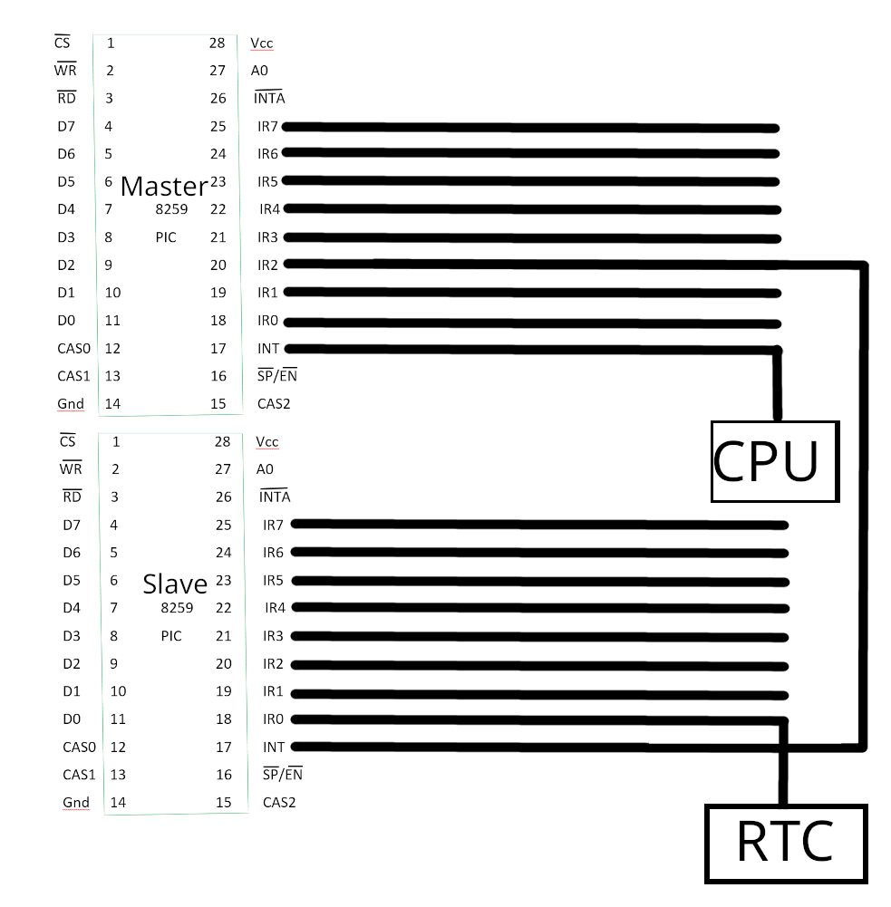

# Interrupt

Interrupts are different from a mere function call.
In microprocessors, interrupts actually halt the current task, and have the CPU to process the interrupts.
After handling the interrupts, the CPU resumes the normal activity.

Imagine when you are listening to music, and your sister called.
You stop what you are doing and handle that phone call.
And after the phone call, you resume from where you left.
This is basically the concept of microprocessor interrupt in a nutshell.

## Hardware Interrupt

Hardware interruptions are interrupts sent by hardware (obviously).
The CPU has two levels of hardware interrupts.
One is INTR (Interrupt Request).
This is a level of interrupt that can be masked (ignored) or delayed.
Normally, they are requests like keyboard being pressed that are not really that important.
NMI (Non-Maskable Interrupts), on the other hand, ~~though can still be masked~~ cannot be masked or ignored.
These interrupts are something among the lines of "Memory Corrupted" or "IO Checksum Failed,"
which are critical, and in most cases non-recoverable errors.

Intel 80386 is messy in its hardware interrupt designs, especially its interrupt controller 8259.
Intel 80386 allows 256 different interrupts, and 8259 is in control of 15 of them.
As for which 15, it is not pre-defined.
Intel 8259 allows its user to change its interrupt number.
That is why Intel 8259 is called a PIC (Programmable Interrupt Controller).

And for some reason,
which is unperceivable to a normal human being,
Intel designed its 8259 to be an 8-pin chip instead of 16,
and decided that it should handle 15 interrupts.
Thus, we need two chips on the motherboard, one is called Master chip, and another is called Slave chip.

<div style="text-align: center" >
    
</div>

### IMR (Interrupt Mask Register)

IMR is an 8-bit register that decides if an interrupt should be masked (ignored).
On each bit, `1` means interrupt is masked, and `0` means interrupt is allowed.

### IO Ports

The IO Ports on the master chip is `0x20` and `0x21`, and that on the slave chip is `0xA0` and `0xA1`.

### IVT (Interrupt Vector Table)

Interrupt Vector Table serves as a reference and a jump table.
The table starts from `0x0000:0x0000` to `0x0000:0x03FF`.

| IVT          | Offset    |
|--------------|-----------|
| ...          | ...       |
| Segmentation | 0000E, +E |
| Offset       | 0000C, +C |
| Segmentation | 0000A, +A |
| Offset       | 00008, +8 |
| Segmentation | 00006, +6 |
| Offset       | 00004, +4 |
| Segmentation | 00002, +2 |
| Offset       | 00000, +0 |

> **Note:** Intel 8259 allows us to set interrupt number, but a single operation on one chip is already an atomic operation.
> Meaning, only the interrupt number for `IR0` is relevant.
> For example, if I want to set `IR0` as `0x08`, then `IR0` to `IR7` is `0x08` - `0x0E`.
> Discrete interrupt number on one chip is ***NOT ALLOWED***!

### Workflow of Hardware Interrupt

1. The processor will push all relevant registers into the stack.
    Clear `IF` and `TF`.
    Then, look up the interrupt vector and perform a long call.

    Since `IF` is cleared, the processor can handle interrupt undisturbed.
    If the user still wants to handle additional interrupt inside the hardware interrupt handler,
    we can use `sti` (SeT Interrupt flag) to allow interrupt.
    (And, instruction `cli`, CLear Interrupt flag, is used to temporarily disable interrupt until it is enabled by `sti` again)

2. Perform interrupt handler.
    CPU will then execute the function marked inside the vector.

3. Resume activity.
    Instruction `iret` (Interrupt RETurn) is used to exit interrupt state and resume processor's normal activity.

> **Note:** NMI is always interrupt 2.

### RTC, CMOS RAM, and BCD

#### RTC (Real Time CLock) and CMOS RAM

RTC, along with many other functionalities a small chip set on the motherboard offers, is a clock device.
Different from other parts on the motherboard,
this chip set continues to work even after we disconnected the power cable.
That is because there is a small battery on the motherboard that keeps this small chip set up and running.
Should it be depleted, the motherboard will give incorrect time, usually reset to its manufacture data,
and the settings inside BIOS will reset to default.

CMOS RAM, or Complementary Metal-Oxide Semiconductor Random Access Memory, is a small memory buffer 
that stores time and other BIOS settings.

This small chip set constantly updates CMOS RAM, mainly its time, and preserves other data set by BIOS,
like AHCI/RAID controller settings and default boot order.

RTC will update CMOS every second.

To access CMOS, we need to first, specify the offset we want to read by index port `0x70` and `0x74`,
and read/write using port `0x71` or `0x75`.

| Offset | CMOS RAM Content |
|--------|------------------|
| 0x00   | RTC Second       |
| 0x01   | Alarm Second     |
| 0x02   | RTC Minute       |
| 0x03   | Alarm Minute     |
| 0x04   | RTC Hour         |
| 0x05   | Alarm Hour       |
| 0x06   | RTC Week         |
| 0x07   | RTC Day          |
| 0x08   | RTC Month        |
| 0x0A   | Register A       |
| 0x0B   | Register B       |
| 0x0C   | Register C       |
| 0x0D   | Register D       |

> Now, here is the weird and ugly part.
> On port `0x70`, the highest bit, bit 7, is NMI mask bit.
> Remember how we said NMI is non-maskable?
> Turns out, it is still maskable, and by writing to port `0x70` without this knowledge,
> we can accidentally mask our NMI without us ever noticing.
>
> The "elegant" way to access `0x70` is to read from it then write to it.
> Now, `0x70` is write-only and doesn't support read.
> So, to address this issue, ICH can be set to enter "ICH mode" to temporarily allow us to read from `0x70`.
> This is a hideous design, and its control is long and painful and is beyond our discussion scope.
>
> Here we just mask it and then unmask it after we finish the job.

##### RTC Register A

<!-- The following table is very ugly, there nothing I can really do about it unless I rewrite it in HTML -->

| bit | Meaning                                                                                                                                                                                                                                                                                                                                                                                                                                                                                                                                                                                                                                                                                                        |
|-----|----------------------------------------------------------------------------------------------------------------------------------------------------------------------------------------------------------------------------------------------------------------------------------------------------------------------------------------------------------------------------------------------------------------------------------------------------------------------------------------------------------------------------------------------------------------------------------------------------------------------------------------------------------------------------------------------------------------|
| 7   | UIP, or update in progress.<br/>UIP is a status bit. When CMOS RAM is being updated by RTC, or is about to updated by it, this bit will be set to 1. Now, if this bit is 0, and CMOS RAM is not going to be updated for at least 488 $\mu$s.<br/>If SET in Register B is 0, and it is correctly set up, the regular update cycle of RTC is 1s.<br/>After UIP is set to 1, the update will begin within 488 $\mu$s, and the whole update cycle will not last more than 1984 $\mu$s. To prevent any damage, there are two safe opportunity to access data: One, when UIP finish interrupt triggers, we have 999 ms to access data. Two, after we detect that UIP being 0, we have 488 $\mu$s to access the data. |
| 6-4 | Frequency Divider Chain Select.<br/>By default it is 010, meaning the frequency is 32,768 Hz                                                                                                                                                                                                                                                                                                                                                                                                                                                                                                                                                                                                                   |
| 3-0 | Rate Select. If PIE is set to 1 in Register B, then RTC will generate a periodical interrupt based on the settings here, else PF in Register C will be set to one. The expected $\text{frequency} =  32768 \gg (rate-1)$.<br/>0000 means "No Interrupt."<br/>Now, If you select a rate of 1 or 2, the RTC will have problems and "roll over" so that it generates interrupts of 0.81 ms and 3.90625 ms, rather than the expected interrupts of 61.0 $\mu$s or 30.5 $\mu$s. So, the fastest rate you can select is 3.                                                                                                                                                                                           |

##### RTC Register B

| bit | Meaning                                                                                                                |
|-----|------------------------------------------------------------------------------------------------------------------------|
| 7   | Update Cycle Inhabit, SET, enable or disable RTC update. This is used to correct RTC in CMOS ROM                       |
| 6   | Periodic Interrupt Enable, PIE, enable or disable periodic update with the interrupt rate set by RS                    |
| 5   | Alarm Interruption Enable, AIE, enable or disable alarm interruption. If enabled, AF will be set to 1 before interrupt |
| 4   | Update-Enabled Interrupt Enable, UIE, enable or disable interrupt after every RTC update                               |
| 3   | Square Wave Enable, SQWE, deprecated and has no effect                                                                 |
| 2   | Data Mode, 0: BCD, 1: Binary                                                                                           |
| 1   | Hour Format, HOURFORM, 0: 12 hour mode, and 0 on the 7th bit means AM, 1 means PM. 1: 24 hour mode                     |
| 0   | Daylight Savings Legacy Software Support, DSLSWS, deprecated and has no effect                                         |

##### RTC Register C

| bit   | Meaning                                                                                                                                                                    |
|-------|----------------------------------------------------------------------------------------------------------------------------------------------------------------------------|
| 7     | Interrupt Request Flag, IRQF, IRQF = (PF & PIE) + (AF & AIE) + (UF & UFE)<br/>When this bit is set to 1, interrupt will occur. Reading from Register C will clear this bit |
| 6     | Periodic Interrupt Flag, PF. If RS bits on Register A is 0000, then this is 0. Otherwise it is 1. Reading from Register C will clear this bit                              |
| 5     | Alarm Flag, AF. Alarm interrupt will set this to 1, and reading from Register C will clear this bit                                                                        |
| 4     | Update-Ended Flag, UF. After each update, this bit will set to 1. Reading from Register C will clear this bit                                                              |
| 3 - 0 | Reserved and is always 0                                                                                                                                                   |

##### RTC Register D

| bit   | Meaning                                                                                                                                          |
|-------|--------------------------------------------------------------------------------------------------------------------------------------------------|
| 7     | Valid RAM and Time Bit, VRT. In writing cycle, this bit is 0, and this bit is set to 1 in read cycle. When RTC initializes, this bit it set to 1 |
| 6     | Reserved and is always 0                                                                                                                         |
| 5 - 0 | Date Alarm, containing dates                                                                                                                     |

#### BCD (Binary Coded Decimal)

BCD, or Binary Coded Decimal, has two formats.
One is called packed BCD.
Packed BCD uses four bits for each digit, meaning 89 is `1000 1001`.
Another is unpacked BCD, meaning eight bits for one digit, and higher four digits are not used. 

> Information: A really easy way to convert digits between base 10/16 to binary is
> what my professor would call "4-bit translation."
> Basically, you write down four digits: `8 4 2 1`, and set the corresponding bit to 1 to match your result.
> For example, `C` is `12`, and immediately we know `8+4=12`, therefore:
> <div class="table-container">
>   <table class="custom-table">
>     <tr>
>       <td>8</td>
>       <td>4</td>
>       <td>2</td>
>       <td>1</td>
>     </tr>
>     <tr>
>       <td>1</td>
>       <td>1</td>
>       <td>0</td>
>       <td>0</td>
>     </tr>
>   </table>
> </div>
>
> So, C is `1100`
> And, 9 is `8+1`, the 9 is `1001`.
> `A` is `10`, and `8+2=10`, so A is `1010`...
> We translate 4 bits each time from base 16 to binary, which is extremely easy.

### Initialize 8259 RTC and IVT

#### Install New Interrupt Handler

Simple.
Just write the corresponding segmentation address and offset to the table.

Now, we actually want to disable interrupt for now.
If we get interrupted while setting up the handler will continue will half-baked settings.

```nasm
    ; install a new interruption handler on 0x70 (Clock)
    mov         ax,         0x70
    mov         bl,         4
    mul         bl
    mov         bx,         ax              ; ax cannot be used as effective addresses, remember?

    ; disable interruption
    cli

    ; clear es to 0
    xor         ax,         ax              ; clear ax
    mov         es,         ax              ; 0 => es

    ; install our new interruption
    mov word    [es:bx],    int_0x70_handler
    mov word    [es:bx+2],  cs
```

Now, we set Register B with relevant information.
By default, 8259 actually masks RTC interrupt.
We have to manually enable it.

```nasm
    ; Access RTC Register B
    mov         al,                     RTC_REGISTER_B
    or          al,                     0x80                ; disable NMI
    out         RTC_REGISTER_INDEX,     al                  ; select RTC register B
    mov         al,                     00010010B           ; disable periodic interruption, interruption after update,
                                                            ; and BCD, 24 hour time
    out         RTC_REGISTER_IO,        al

    ; Access RTC Register C, so that we clear all interruption flags
    mov         al,                     RTC_REGISTER_C      ; we actually want to resume NMI here
    out         RTC_REGISTER_INDEX,     al                  ; NMI is now resumed
    in          al,                     RTC_REGISTER_IO

    in          al,                     I8259_IMR           ; read from 8259
    and         al,                     0xFE                ; 0xFE is 0x11111110, clear RTC port so we can receive RTC interruptions
    out         I8259_IMR,              al                  ; write back
```

Now, we re-enable interrupt, and just wait for interrupt to happen:

```nasm
    ; enable interruption
    sti
    
    .loop:
        hlt
        jmp     .loop
```
I will skip the exact workflow of reading from RTC and printing its content then translate BCD to ASCII,
since it is very straightforward to implement.
One thing I didn't point out is that 8259 actually doesn't know when the interrupt ended.
It's external hardware, remember?
Due to this, we have to manually tell 8259 so that it knows we are done, otherwise we will only hear from it once.
Also, remember to read from Register C so it clears the interrupt flags and allows us to hear from RTC interrupt again.
After that, use `iret` to resume activity.

```nasm
    ; Clear the RTC interrupt flags by reading Register C
    mov         al,                 RTC_REGISTER_C
    out         RTC_REGISTER_INDEX, al                  ; Select Register C, and enable NMI
    in          al,                 RTC_REGISTER_IO     ; Read Register C to clear flags

    ; Send End of Interrupt (EOI) signals
    mov         al,                 EOI
    out         SLAVE_8259,         al                  ; EOI to slave PIC
    out         MASTER_8259,        al                  ; EOI to master PIC
    ; if pushed any registers, now is the time to pop it here:
    ; ...
    iret
```

## Software Interrupt

Software interrupt is interrupt generated by software, not hardware.
Software interrupt has three main formats:
```nasm
    int3
    int imm8
    into
```

`int3` is interrupt number 3.
It behaves exactly like `int 3`.
However, its machine code is a single `0xCC`.
It is widely used in debugging procedure where the user would modify the running instructions to `0xCC`
and cause an interrupt to print relevant information, serving as a breakpoint of some sorts.

> A strategy to use `int3` is to push all relevant information into the stack,
> since BIOS interrupt invocation code will mess with the register content.
> > This method of debugging, however, is becoming obsolete, since much more advanced debugging method
> > and tools, like QEMU+GDB, are already present and are constantly improving.
> > It can serve as a hack strategy, however, and is relevant in extreme conditions, like real hardware,
> > where the use of a real debugger is usually impossible.

`into` is "Interrupt if Overflow."
If `OF` is set to 1, then a interrupt number 4 will generate.
Otherwise, this interrupt has no effect.


### BIOS Interrupt

BIOS offers a lot of different software interrupts.
Like I said before, we can use interrupt to invoke BIOS functions without knowing its exact position.

Below is a simple program that utilizes two main functions in BIOS:

```nasm
    .loop:
        xor         ah,         ah          ; 0 => ah
        int         0x16                    ; monitor keyboard interruption

        ; print content inside keyboard, content is in al
        mov         ah,         0x0E
        int         0x10
    jmp         .loop
```

We call BIOS to monitor keyboard interrupt, when a key is pressed, we will get its result in al.
Then we print this key using BIOS TTY (teletype, an electronic typewriter, actually a really cool device)
function.

---

[Chapter 6](./6_32bit_protected_mode.md)

[Back to the Main Page](../README.md)
