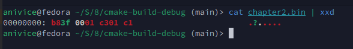
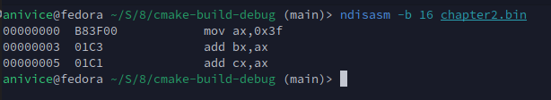

# Assembly

In Bash, the `ls` command is used to list all files and directories in
the current directory. Additionally, we can append a parameter,
such as `/`, to list all files and directories under the root directory (`/`).

This concept is similar to how assembly language operates:
it involves issuing low-level commands to perform specific operations.
Here's an example of assembly language:

<a id="assembly-code"></a>
```nasm
    MOV AX, 0x3F
    ADD BX, AX
    ADD CX, AX
```

In this example:
- `MOV AX, 0x3F` moves the value `0x3F` into the `AX` register.
- `ADD BX, AX` adds the value in `AX` to the `BX` register.
- `ADD CX, AX` adds the value in `AX` to the `CX` register.

Assembly language, like Bash commands, allows precise control over operations,
albeit at a much lower level.

The use of the `0x` prefix to indicate hexadecimal numbers was likely
popularized by Unix. The development of Unix and its heavy reliance on the
C programming language helped establish the `0x` prefix as a standard.
Many Unix tools and utilities were written in C, further spreading the
convention through their widespread use.

Ensure that `nasm`, `cmake`, `make`, and `vim` are installed.
You can install them using the following commands, based on your Linux distribution:

### Debian (and derivatives, such as Ubuntu):
```bash
sudo apt update
sudo apt install nasm cmake make vim
```

### Fedora:
```bash
sudo dnf install nasm cmake make vim
```

### Arch Linux (and derivatives, such as Manjaro):
```bash
sudo pacman -S nasm cmake make vim
```

### openSUSE:
```bash
sudo zypper install nasm cmake make vim
```

These commands will ensure that
`nasm` (Netwide Assembler),
`cmake` (build tool),
`make` (build automation tool),
and `vim` (text editor) are installed on your system.

[The above assembly code](#assembly-code) can be compiled using the following commands:

```bash
# Ensure you are at the root of the project tree
mkdir build && cd build && cmake .. && make
```

The compiled binary for [the above assembly code](#assembly-code)
is named `chapter2.bin`. You can view its contents using the following command:

```bash
cat chapter2.bin | xxd
```

This will display the binary content in a hexadecimal format,
which should look like this:



To examine the binary further, you can disassemble it using `ndisasm`,
a tool provided by NASM. Disassembly is the process of converting machine
code into human-readable assembly instructions.
To disassemble `chapter2.bin`, use the following command:

```bash
ndisasm -b 16 chapter2.bin
```

The output will display the disassembled instructions, similar to this:



---

[Chapter 3]()

[Back To Main Page](../README.md)
